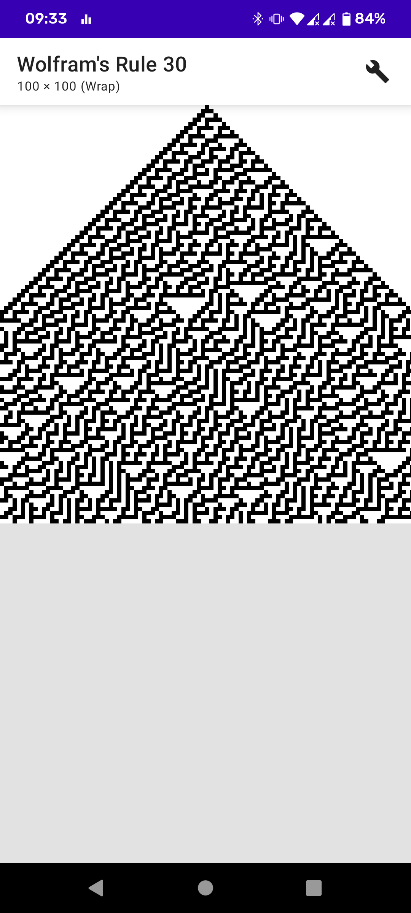
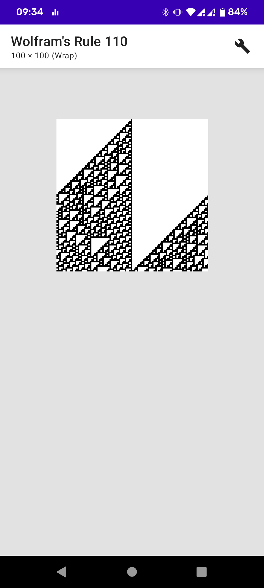
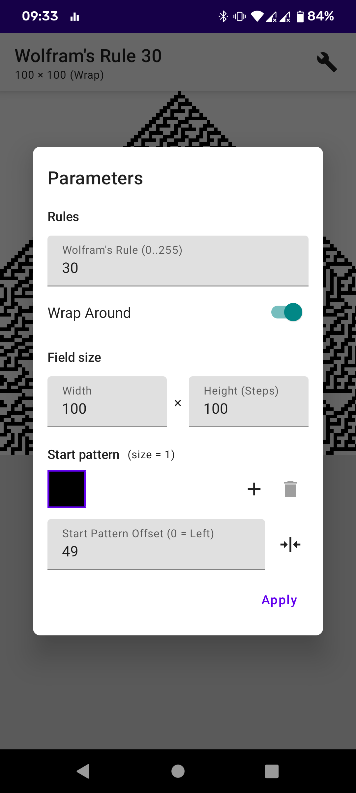
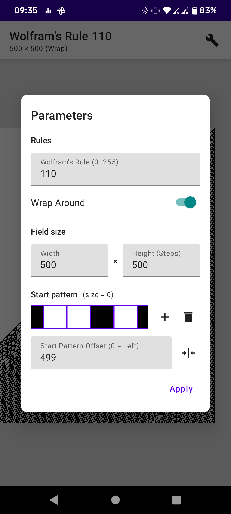
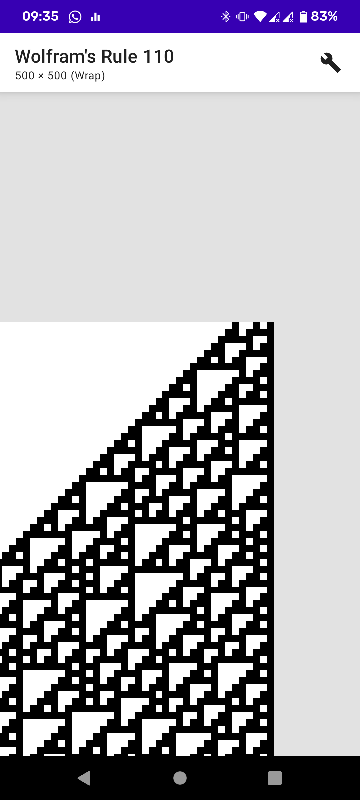

# Wolfram Cells

An android app for making and viewing Wolfram rules simulations.

The app is written in Kotlin and uses Jetpack Compose as its framework.

## Current features:

- Generating fields of different sizes (up to 1024x1024) and different Wolfram rules (0..255)
- Panning, zooming of the field view
- Customizing start pattern and its offset
- Dark mode

## Planned features:

- A grid for the field
- Saving snapshots of the field as images
- Ability to draw on the field
- Adding more cellular automata types

## Screenshots:

Here's an example of changing the starting pattern:

